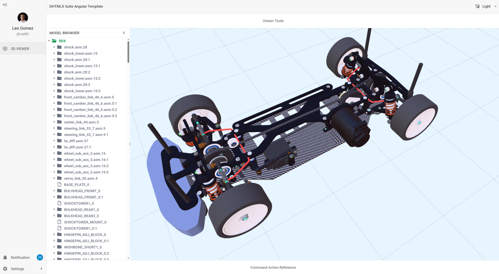

# CAD Administrator UI (DHTMLX + BabylonJS)

Angular 21 product for CAD administration and engineering review, built with web technologies using DHTMLX Suite as the application shell and BabylonJS as the 3D engine.

The project is a strict CAD product delivered on a modern web stack: an engineering workspace with interactive 3D visualization, model-structure navigation, and domain-oriented workflows for technical stakeholders. The roadmap extends this core product with broader PLM/PDM and inventory capabilities without changing its CAD-first identity.

## Product Direction

- Deliver a CAD product on web technologies without depending on native desktop tooling
- Provide 3D visualization for engineering review, inspection, and technical decision-making
- Expose model structure as a first-class CAD workflow surface
- Keep runtime layout and viewer behavior driven by external configuration
- Extend the CAD core with PLM/PDM-style metadata and inventory capabilities over time

## Engineering Use Cases (Target Scope)

- Interactive 3D model review in a CAD-focused web product
- Assembly and part structure navigation from the loaded model
- Configurable engineering workspace for CAD-related modules and workflows
- Foundation for future metadata validation, release-readiness checks, and inventory attributes
- Lightweight viewer experience for manufacturing, quality, and sourcing stakeholders

## Viewer Controls Quick Guide

- Orbit: hold `Shift` + drag with the middle mouse button.
- Pan: drag with the middle mouse button (without `Shift`).

## Screenshot



## Current Status

Implemented:
- Angular shell and config-driven DHTMLX layout
- BabylonJS scene integration inside `main-viewer-area`
- GLB loading pipeline (`public/models/RDX.glb`)
- Model browser tree generated from the loaded Babylon scene graph
- Camera fit from reusable model bounds feature
- Ground grid behavior (scaled from model bounds)
- Reflection environment/material pass (reusable feature)
- Layout resize stability fix for collapse/expand/resize
- Viewer scene configuration externalized (`public/config/viewer-scene.config.json`)

Not implemented yet (planned):
- Tree-to-viewer selection sync and richer viewer actions
- PLM/PDM-style metadata panel (part number, revision, lifecycle status)
- Inventory attributes panel (availability, supplier refs, stocking notes)
- Advanced viewer tooling (isolate, overlays, richer inspection actions)
- Backend-driven runtime config endpoints (currently static JSON)

## Stack

- Angular CLI 21.2.x
- DHTMLX Suite 9.x (`dhx-suite`)
- BabylonJS 9.x (`@babylonjs/core`, `@babylonjs/loaders`, `@babylonjs/materials`)
- TypeScript 5.9.x

## Run Locally

```bash
npm install
npm start
```

After install, git hooks are configured automatically via `npm run prepare`.

Default URL is usually `http://localhost:4200/`.
If the port is busy, Angular CLI will prompt for a different port.

## Build

```bash
npm run build
```

Note: production build currently fails because the default Angular bundle budget is exceeded after BabylonJS integration. This is expected at the current stage.

## Test

```bash
npm test
```

Note: test runs may fail in this template while working with static/demo JSON auth flows. This is expected for the current static mode and does not block local viewer development.

## Commit Message Policy

This repository enforces conventional commits and English-only commit messages.

Allowed examples:
- `feat(viewer): add selection outline layer support`
- `fix(viewer): prioritize model picking over ground`
- `docs(readme): document CAD selection bugfix`

Checks enforced by hook:
- Conventional commit format is required.
- Spanish accented characters are blocked.
- Common Spanish terms are blocked in commit subjects.

Hook setup command:

```bash
npm run setup-hooks
```

## Known Errors (Current Stage)

### 1) Production build budget error

Typical error:
- `bundle initial exceeded maximum budget`

Why it happens:
- Angular production build enforces size budgets from `angular.json`.
- After adding BabylonJS packages (`@babylonjs/core`, loaders, materials), the initial bundle is bigger than the template's default budget limits.
- This is not a runtime crash; it is a build-time budget guard.

Current impact:
- `npm start` works for local development.
- `npm run build` fails until budgets are adjusted or viewer code is split/lazy-loaded.

### 2) Test errors with static config URLs

Typical errors:
- `Failed to parse URL from /config/viewer-layout.config.json`
- `Failed to parse URL from /config/sidebar.data.json`
- `Failed to parse URL from /config/top-menu.data.json`

Why it happens:
- The app currently runs in static/demo mode and loads config/auth-related JSON from absolute browser-style paths under `/config/...`.
- In Vitest/Node test environment, there is no real browser origin serving these files, so `fetch('/config/...')` becomes an invalid URL in that context.
- DHTMLX data loading and viewer bootstrap depend on these JSON files during component initialization.

Current impact:
- Unit tests may fail in CI/local test runs unless fetch/config loading is mocked.
- This behavior is expected in the current static template stage.

## Viewer Architecture

Main viewer component:
- `src/app/features/viewer/viewer.module.component.ts`

Reusable viewer features:
- `src/app/features/viewer/model-bounds.ts`
	- Centralized world bounds calculation utility
	- Reused for camera fit and grid sizing
- `src/app/features/viewer/viewer-scene-bootstrap.ts`
	- Base Babylon bootstrap (engine creation, scene, camera, light, ground, grid)
	- Keeps `viewer.module.component.ts` focused on orchestration
- `src/app/features/viewer/viewer-model-loader.ts`
	- Model import and framing workflow (bounds, camera fit, ground/grid updates)
	- Designed for future UI/API-triggered model loading
- `src/app/features/viewer/viewer-scene.config.ts`
	- Canonical scene configuration contract (engine, camera, grid, environment)
	- Parsing, validation, and defaults for external scene config payloads
- `src/app/features/viewer/viewer-interaction-controls.ts`
	- Encapsulated pointer interaction orchestration (orbit + pan)
- `src/app/features/viewer/viewer-reflections.ts`
	- Reflection environment initialization
	- Reflection application on PBR/Standard materials

### Why this split

The goal is to keep viewer orchestration in the component and move reusable technical logic into isolated feature modules. This allows the same math/visual behaviors to be reused in future viewer actions without duplicating logic.

## Viewer Scene Config Externalization

What changed:
- Scene and rendering configuration was extracted from `viewer.module.component.ts` into `src/app/features/viewer/viewer-scene.config.ts`.
- The runtime payload source was added at `public/config/viewer-scene.config.json`.
- Pointer interaction orchestration is now in `src/app/features/viewer/viewer-interaction-controls.ts`.

Why this was done:
- Keep the viewer component focused on orchestration, not hardcoded rendering constants.
- Enable future runtime customization from external sources (UI/API/DB) without restructuring the viewer core.
- Preserve current behavior while creating a stable, typed configuration contract for later extension (including future WebGPU selection workflows).

Current behavior note:
- No new viewer tools UI is introduced in this step.
- The viewer still works with the same defaults, now loaded through the extracted scene config pipeline.

## Viewer Orchestration Refactor (Phase 1 + Phase 2)

What changed:
- Base scene bootstrap was extracted into `src/app/features/viewer/viewer-scene-bootstrap.ts`.
- Model loading and framing workflow was extracted into `src/app/features/viewer/viewer-model-loader.ts`.
- `viewer.module.component.ts` now orchestrates these modules instead of implementing all Babylon details inline.

Why this was done:
- Reduce cognitive load in the main viewer component for demo and onboarding purposes.
- Keep the current demo behavior unchanged (model still auto-loads).
- Prepare a clean path to future on-demand model loading via UI/API without reworking core scene logic.

## DHTMLX + Babylon Resize Stability Fix

When the model browser cell is collapsed/expanded or resized, the Babylon canvas can become visually distorted if the engine viewport is not resized at the right time.

Implemented fix:
- DHTMLX layout event hooks: `afterCollapse`, `afterExpand`, `resize`, `afterResizeEnd`
- `ResizeObserver` on the actual viewer container
- Frame-scheduled viewport refresh (`engine.resize()` + `scene.render()`)

This combination fixes the visual issue during:
- Collapse/expand of `model-browser`
- Manual cell resize
- Generic layout invalidation cycles

## CAD Selection Bugfix (Ground Blocking Picks)

Issue observed:
- In some orbit angles, clicking a part failed because the ground/grid was hit first.
- This behavior is not aligned with CAD expectations, where model selection should work from any view angle.

Root cause:
- Pointer pick resolution used the first hit, and the ground could intercept the click before model nodes.

Fix applied:
- Selection flow now prioritizes model-only picking first (`mesh !== ground` and selectable-node filter).
- Ground picking is evaluated only as a fallback for deselection when no model node is hit.

Result:
- Parts remain selectable even when the grid is visually in front from the current camera angle.
- Clicking empty ground still clears the current selection.

## Config-Driven Shell

UI shell remains config-driven via static JSON files:
- `public/config/sidebar.data.json`
- `public/config/top-menu.data.json`
- `public/config/viewer-layout.config.json`

This keeps the template backend-ready: static JSON can later be replaced by API responses with the same schema.

