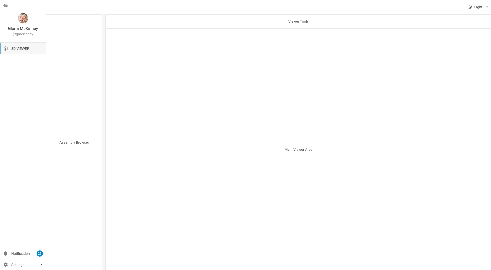

# Angular + DHTMLX Suite Viewer Starter

Clean starter template for building a Viewer module UI with Angular and DHTMLX Suite.

This starter uses the open-source version of DHTMLX Suite (NPM package: `dhx-suite`).

## UI Preview



*Preview v0.2.0 - Light Theme (Current Baseline)*

This repository intentionally includes:
- Angular app shell
- DHTMLX Suite integration
- Viewer module baseline layout (3L-style structure)

This repository intentionally does not include:
- BabylonJS integration
- Full PDM or Inventory module implementations

## Stack

- Angular CLI 21.2.x
- DHTMLX Suite 9.x
- TypeScript 5.9.x

## Run locally

```bash
npm install
npm start
```

Open http://localhost:4200/

## Build

```bash
npm run build
```

## Test

```bash
npm test
```

## Starter scope

Current template scope is focused on Viewer UI foundation:
- Left panel: Assembly Browser placeholder
- Top strip: Viewer Tools placeholder
- Main area: Viewer canvas placeholder

You can extend this baseline with your own business modules and rendering engine later.
